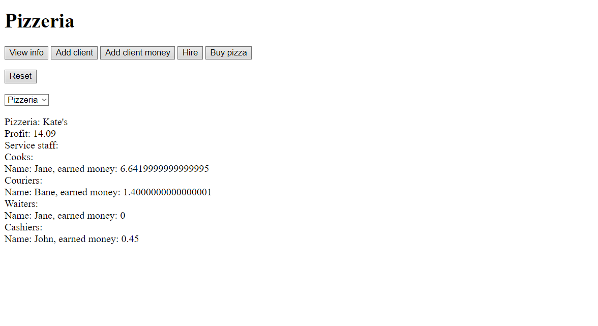
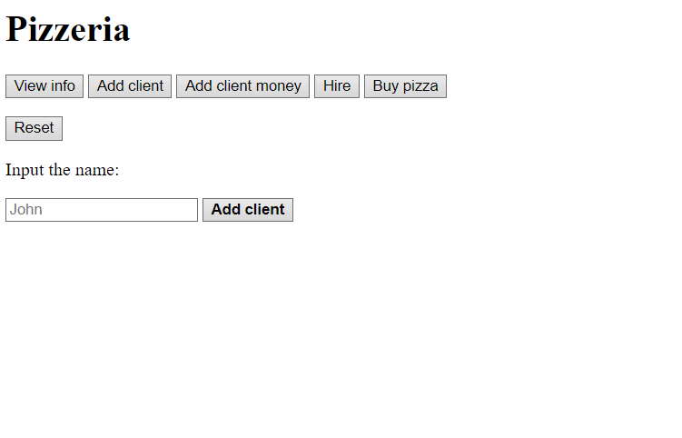
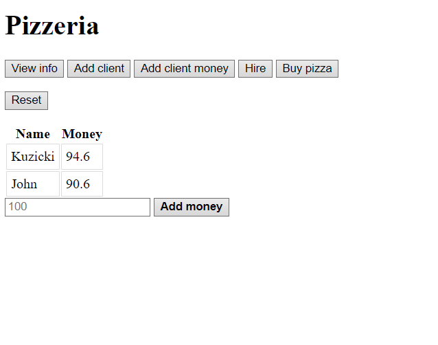
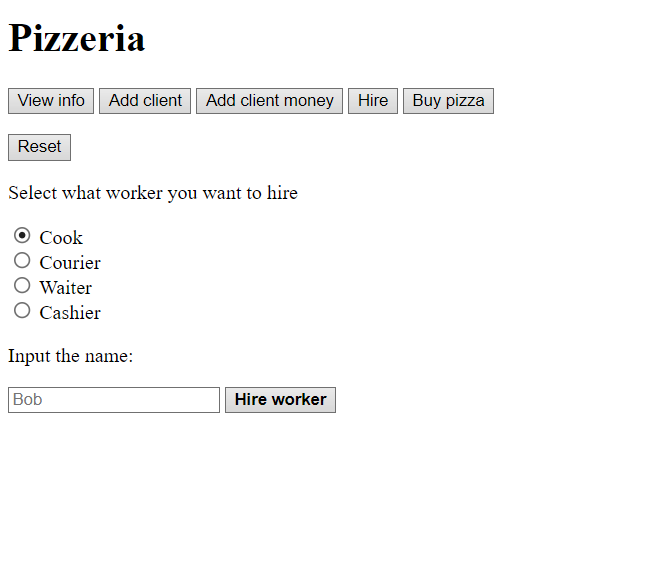
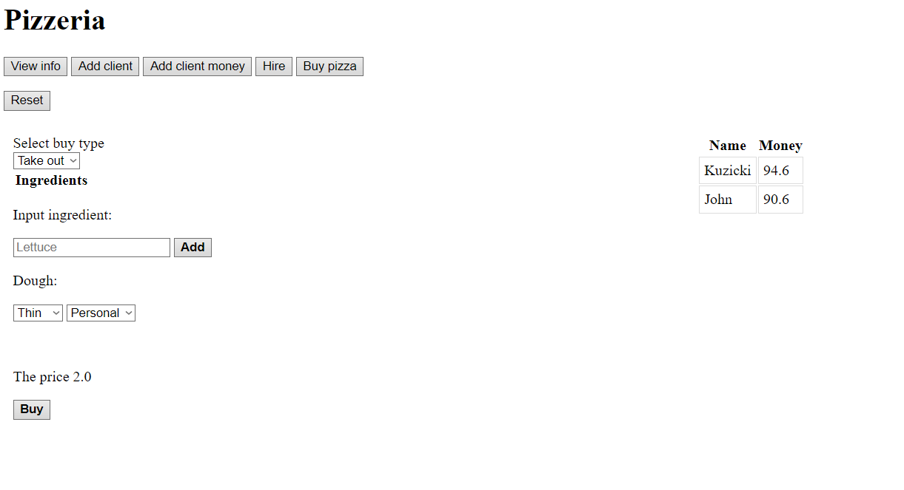

# Pizzeria UI

## Цель:
Целью данного задания было изучение архитектурных приемов построения пользовательского интерфейса и принципов создания веб-приложений. Необходимо было разработать веб-интерфейс системы пицерия, используя лабораторную работу №1 как основу.

## Задание:
Необходимо разработать веб-интерфейс к программной системе, которая была получена в лабораторной работе №1.

## Реализация
Для реализации веб-интерфейса был выбран фреймворк Flask. С помощью него можно быстро и удобно создавать веб-приложения благодаря своей простоте и гибкости в использовании.

### Интерфейс приложения
#### Основное окно

#### Окно для добавления клиента

#### Окно для добавления клиента

#### Окно для добавления денег клиента

#### Окно для добавления работников

#### Окно покупки пиццы

### Вывод

В результате выполнения лабораторной работы ознакомился с основами архитектурных приемов построения пользовательского интерфейса и принципов создания веб-приложений на языке Python с использованием фреймворка Flask. Также я изучил работу AJAX-запросов, что позволило динамически изменять интерфейс приложения в зависимости от информации на странице.